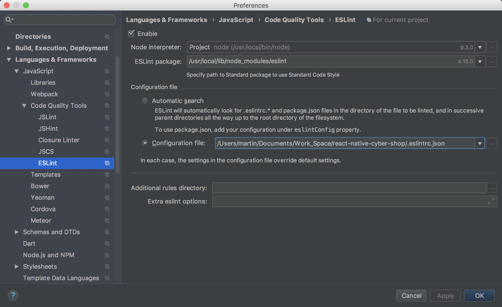
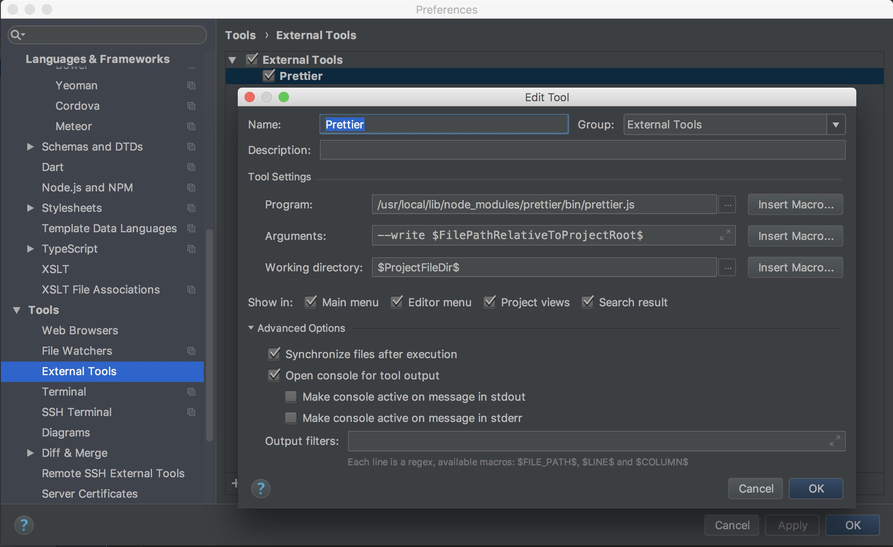

#### 背景

从17年十月份，公司领导提出新增react-native技术栈，目前我们原生团队负责调研这一技术以及新产品4.0的开发。调研期间，团队内部自己测试用的demo没有特殊要求，但是从上个月开始开发的新产品4.0则需要按照公司的代码规范以及工作流维护在gitlab上。

#### 正文

前端团队使用eslint进行代码检测及审核，最近有新增了prettier代码格式化工具，这为我们的开发工作提供了不少便利，接下来我大概介绍一下在webstorm和vscode这两种编辑器上面的配置

- webstorm

  webstorm是我们组内之前一直在用的，不少插件和设置都比较方便，对eslint的支持也比较好：

  首先在全局安装eslint

  ```bash
  npm install -g eslint
  ```

  安装完成后再进入到你现在需要配置eslint代码检测的项目目录下，使用下面命令初始化一个配置文件

  ```bash
  eslint --init
  ```

  这个命令会有一系列需要你去选择的配置项，如果你不清楚，可以一直按回车，因为这些配置项我们到后面都可以自行去修改，这个命令结束以后可以去看你项目目录下，会多了一个eslintrc文件，可能是json、yaml、js的后缀，取决于你在init命令下做的选择。

  接下来我们打开webstorm，webstorm自身有对eslint的集成，我们只需要稍作配置

  依次选择 WebStorm —> Prefrences —> Language&Frameworks —> JavaScript —> Code Quality Tools

  然后会看到Eslint选项，在右边的配置面板，我们做如下配置

  


  这里的 ESlint package 是指你在全局安装的eslint路径，Configuration file 则需要指定你刚刚在项目目录生成的eslintrc.*文件。

到这一步为止，我们已经配置好了webstorm的eslint检测，具体的eslintrc文件配置取决于个人的代码标准，语法相关的可以参考[eslint中文网](http://eslint.cn/)，这里不再赘述。

接下来是配置prettier，首先全局安装

```bash
npm install -g prettier
```

安装完成以后打开webstorm，依次打开  Prefrences —> Tools —> External Tools 

在右侧页面中点击加号，新增一个tools ，具体配置如下图



这里的prettier.js路径就是你在全局安装的prettier的路径，现在prettier的配置也已经完成了，需要注意的是prettier的缩进方式默认为两个空格，可以在项目目录下新建prettierrc.json文件，在文件中定义你需要的一系列格式。

- 使用prettier自动格式化代码

  你可以在webstorm工具栏中选择Tools —> External Tools —> Prettier 进行格式化操作，但是这样操作多有不便，所以我推荐下面这种方式

  webstorm提供一个宏录制功能，可以将多个操作组合在一起，形成一个宏命令。

  打开 Edit —> Macros —> Start Macro Recording ，选择start之后，你做的所有操作都会被录制到宏命令内

  - 首先保存当前页面的代码修改
  - 选择Tools —> External Tools —> Prettier 进行格式化
  - command + 4 关闭输出框

  操作完成以后，选择Edit —> Macros —> Stop Macro Recording ，会弹出提示框设置宏命令的名字，比如命名为 “ Save&Format ” 。

  接下来，我们为这个宏命令指定一个快捷键

   WebStorm —> Prefrences —> keymap

  在右侧页面选择你设置的宏，给它添加一个快捷键，我在这设置的是command+s 取代了之前的保存快捷键。

  ​

下一篇将继续配置vscode。
