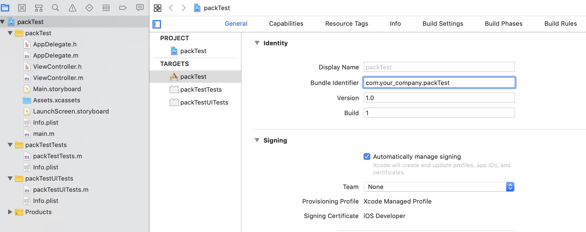
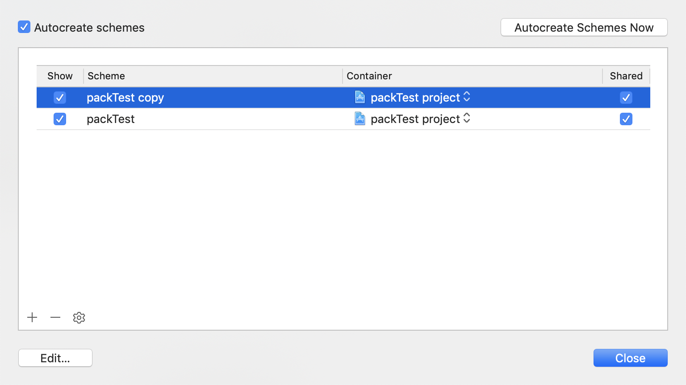

> 此博文旨在记录自己在工作过程中遇到的问题及解决办法，温故而知新。*

近期的一个项目中使用到了 4 套环境，每套环境都有自己的 bundleId 以及 displayName ，并且不同环境下的证书也都不一样，如果每次打包都要人工手动操作的话，不仅浪费时间，同时也是大量的重复工作，所以，我进入项目组的第一份工作就是开发多套环境下的自动打包工具。


> fastlane

说到自动化打包，iOS 开发工程师基本第一时间会想到 fastlane ，这是我们经常用到的工具，它不仅可以简化打包流程，并且还可以通过配置把应用上传到一些包管理平台，例如 pgyer、fir.im 等，或者直接上传至 itunesConnect ，具体的配置可以参考 [fastlane]() 的官方文档。


> RN 中的多环境配置

在 RN 项目中，我们用到 [react-native-config]() 来处理多套环境的切换:

- 在项目中引入组件

  ```
  $ yarn add react-native-config
  ```

- 因为涉及到原生部分，所有需要执行 link 操作

  ```
  $ react-native link react-native-config
  ```

接下来，在 RN 部分做一下配置，在项目根目录下创建 4 个文件，分别对应 4 套环境：

```
.env.dev          # 开发环境 
.env.qa						# 测试环境
.env.uat					# UAT环境
.env.production   # 生产环境
```

在这些文件里只需要添加各自环境对应的标识，如 `.env.dev` 文件中：

```
ENV=dev
```

需要知道的是，在项目下执行以下命令可以切换当前选中的环境：

```
$ ENVFILE=.env.dev
```

然后在项目的常量配置文件中引入 `react-native-config` 组件：

```javascript
import Config from 'react-native-config';

// 拿到当前选中的 env 文件对应的环境标识，可以通过这个标识定义对应的 host 等
Config.ENV 
```

到了这一步，RN 部分的环境配置暂时告一段落，接下来是重点部分，把原生部分的配置和 RN 配置串联起来


> iOS 一套代码如何生成不同的安装包

由于在打包时需要产出不同环境下的包，并且它们都有自己的 bundleId 和 displayName ，以及各自的证书配置，所以在 iOS native 这边，我们使用多个 targets 的方式处理，每个 iOS project 都会有自己的 targets ，这里可以查看官网对 targets 的介绍：

*A target specifies a product to build and contains the instructions for building the product from a set of files in a project or workspace. A target defines a single product; it organizes the inputs into the build system—the source files and instructions for processing those source files—required to build that product. Projects can contain one or more targets, each of which produces one product.**

这段介绍的大致意思就是说，每个 iOS project 都会有 target ，每个 target 都包含当前项目的一套配置，而每个 project 项目可以包含多个 targets ，target 之间互相独立，可以产出独立的 product。所以我们利用 target 的这个特性，可以在原有的 target 基础上再复制另外 3 个，然后再各自修改对应的配置，这样就可以用同一份代码产出不同环境的安装包，接下来记录一下操作流程 :

1. 首先进入 Xcode ，打开项目 :

   


2. 在右侧能看到 targets 栏，选中当前默认的，然后右键，能看到 Duplicate 选项，或者直接 command + D ，这样就可以复制一个新的 target ，命名为 `packTestQA` ，同样的道理，依次创建对应其他几个环境的 target ，创建完成以后点击 Product -- scheme -- manage schemes ，会看到默认的 packTest 之外又多了3 个 copy 的 scheme :

3. 选中其中一个点击左下角的 edit ，在新的页面里可以看到，当前的 scheme 对应的是我们刚刚创建的 target ，每个 target 都对应着一个 scheme ，接下来要在 scheme 的编辑页面添加对应的配置，找到对应 target 的scheme，点击 edit ，然后点击左边的build栏，添加一个 pre-action :这是 react-native-config 组件中提供的方式，在项目编译时通过执行这段脚本来设置当前的环境。


> 串联

1. iOS native 部分已经完成了多个 targets 的相关配置，fastlane 也已经安装完成，下面要做的就是把这两部分串联起来，进入 项目根目录/ios 目录下，执行 `fastlane init` 命令，在 init 过程中，会出现  `What would you like to use fastlane for?`  这样一个问题，并列出 4 个选项，选择第 4 项就可以；

2. init 完成以后能看到在 ios 目录下多了一个 fastlane 文件夹，打开里面的 Fastfile ，添加打包的命令：

   ```ruby
   platform :ios do
     desc "QA 环境打包"
     lane :qa do |options|
     gym(
       clean: true,
       export_method: "ad-hoc",
       scheme: "packTestQA",      # 每个 scheme 对应一个 target
       configuration: "Release",
       output_directory: "./app",
       output_name: 
       "packTestQA" + "#{increment_build_number(build_number: number_of_commits)}"
     )
     end
   end
   ```

   这样一来，就可以通过 `fastlane qa` 命令打出 qa 环境的安装包，然后在把命令稍加整合放到 package.json 里面 :

   ```json
   "ios-qa": "cd ios && ENVFILE=.env.qa fastlane qa",
   ```

   这样在项目的根目录下执行命令 `yarn ios-qa` 就可以打出 qa 环境的安装包；

   

   **注** : fastlane 还有很多其他的定制化配置可以提高开发效率，比如自动上传至包分发平台等等，这些配置建议参考其官方文档。

